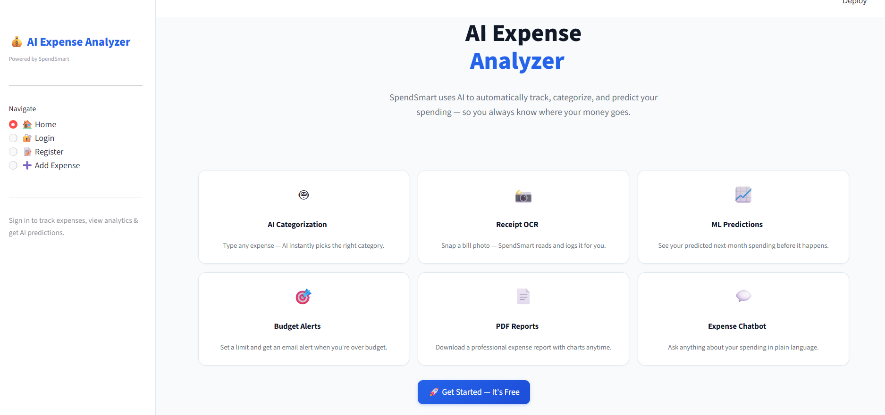
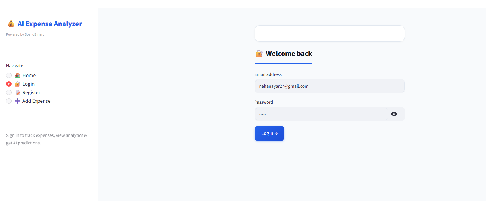
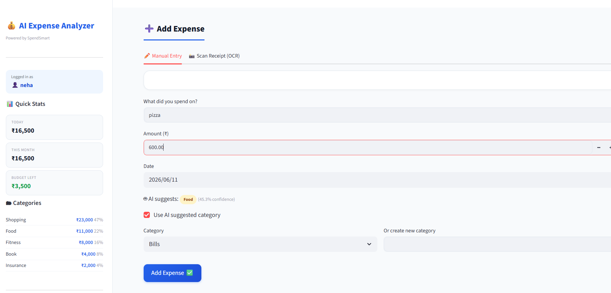
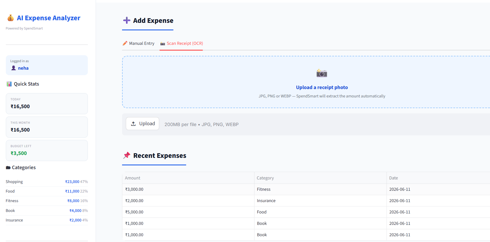
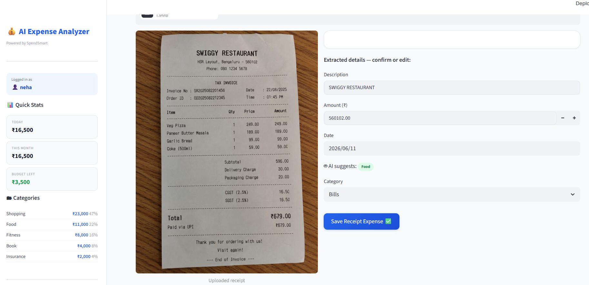
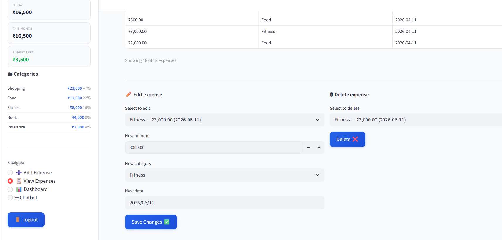
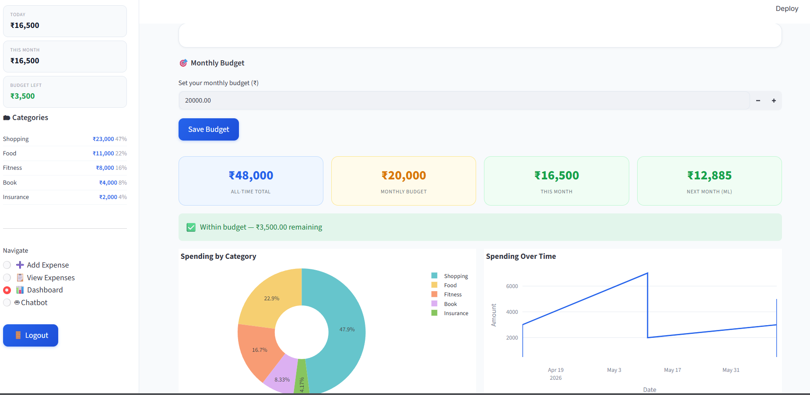
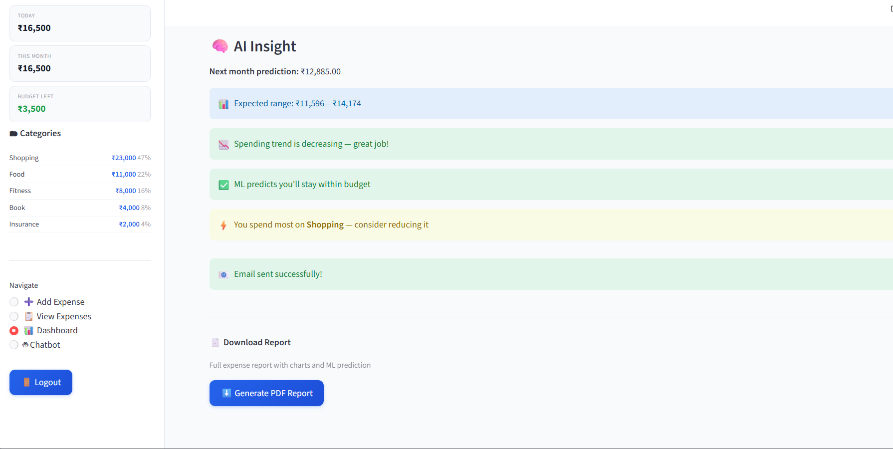
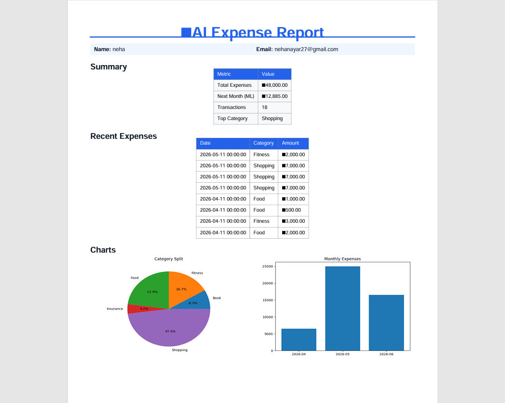
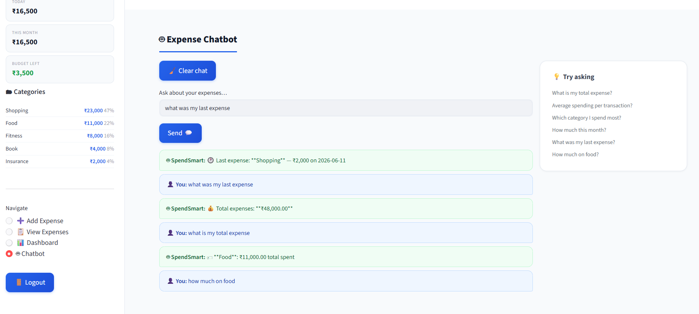

# 💰 SpendSmart — AI Expense Analyzer

An end-to-end AI-powered personal finance tracker built using **Streamlit, Machine Learning (Prophet), OCR (Tesseract), NLP (SentenceTransformers), and SQLite**.

---

## ✨ Features

| Feature | Description |
|---|---|
| 🤖 AI Categorization | Automatically classifies expenses using SentenceTransformer embeddings |
| 📸 Receipt OCR | Upload receipt images and extract text + amount using Tesseract |
| 📈 ML Forecasting | Prophet model predicts future monthly spending trends |
| 🎯 Budget Alerts | Set monthly budget and receive email notifications |
| 📄 PDF Reports | Download professional expense reports with charts |
| 💬 AI Chat Assistant | Ask questions about your spending in natural language |
| 🔒 Secure Authentication | bcrypt-based login system with validation |
| ✏️ Edit Expenses | Modify or update past transactions anytime |

---

## 🌐 Live Demo
https://ai-expense-analyzer-neha.streamlit.app/

---

## 🚀 Setup Instructions

### 1. Clone Project
git clone <your-repo-url>
cd spendsmart

### 2. Virtual Environment
python -m venv .venv
.venv\Scripts\activate   (Windows)
source .venv/bin/activate   (Mac/Linux)

### 3. Install Dependencies
pip install -r requirements.txt

### 4. Install Tesseract OCR
Windows: https://github.com/UB-Mannheim/tesseract/wiki
Mac: brew install tesseract
Linux: sudo apt install tesseract-ocr

### 5. Setup Environment Variables
cp .env.example .env

EMAIL_USER=your_email@gmail.com
EMAIL_PASS=your_app_password

https://myaccount.google.com/apppasswords

### 6. Run App
streamlit run main.py

http://localhost:8501

---

## 📁 Project Structure

spendsmart/
├── main.py
├── auth.py
├── database.py
├── model.py
├── report.py
├── requirements.txt
├── .env
├── .env.example
└── expense.db

---

## 🧠 How It Works

📊 Dataset:
- No external dataset used
- Data stored in SQLite (user expenses)
- Fields: date, amount, category, description

👉 System learns from user data over time

---

🤖 AI Categorization:
- SentenceTransformer (all-MiniLM-L6-v2)
- Converts text → embeddings
- Matches best category

Example:
"Swiggy dinner" → Food 🍕

---

📸 OCR Processing:
- pytesseract (Tesseract OCR)
- Extracts text from receipts
- Finds amount & details

---

📈 ML Forecasting:
- Facebook Prophet model
- Converts data into time series
- Predicts future spending trends

---

📊 Feature Engineering:
- Monthly spending
- Category-wise analysis
- Transaction patterns
- OCR extracted values

---

🗄️ Database (SQLite):

id | date | category | amount | description

---

📄 PDF Reports:
- ReportLab + Matplotlib
- Pie chart + Bar chart
- Professional single-page report

---

🔐 Authentication:
- bcrypt password hashing
- Secure login/register system
- Email validation

---

💬 Chatbot:
- Rule-based AI assistant
- Answers:
  - Total spending
  - Category insights
  - Monthly analysis

---

## 🛠 Tech Stack

Streamlit | Python | SQLite | Prophet | SentenceTransformers | Tesseract OCR | Plotly | Matplotlib | ReportLab | bcrypt

---

## 📸 Screenshots

### 🔐 Login Page

---

### 📝 Register Page

---

### ➕ Add Expense Page

---

### 📸 OCR Receipt Scanner (Step 1)

---

### 📸 OCR Receipt Scanner (Step 2)

---

### 📊 Dashboard View

---

### 📈 Analytics View

---

### 🤖 AI Chatbot

---

### 📄 PDF Report

---

### 📄 Final Report Output

## 🔥 Key Highlights

- No dataset required (self-learning system)
- AI + ML + OCR combined project
- Learns from user behavior
- Offline capable (except email alerts)
- Production-level structure

---

## 🚀 Future Improvements

- WhatsApp alerts
- Bank sync
- LLM chatbot upgrade
- Cloud deployment
- SaaS multi-user version
